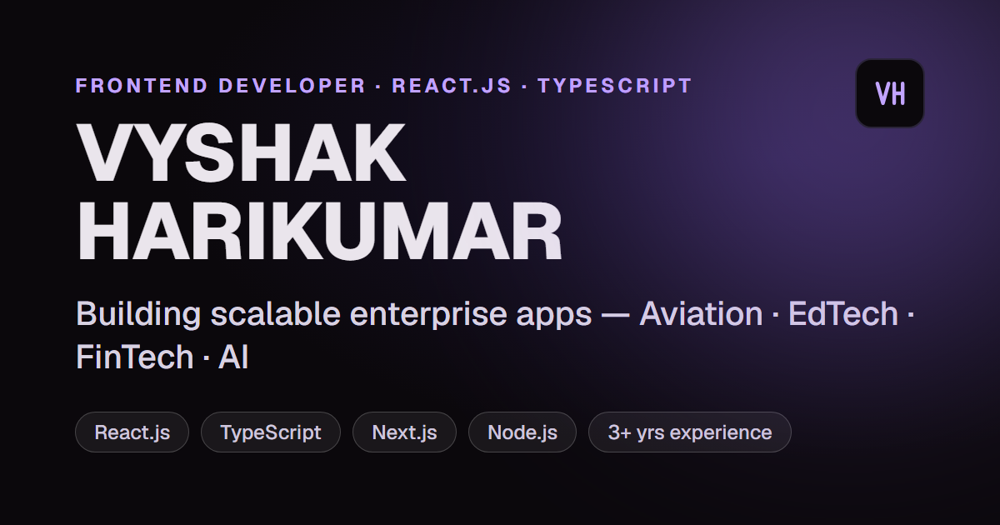

# Vyshak Harikumar - Personal Portfolio Website 🚀

This repository contains the source code for my personal portfolio website. Built using React, TypeScript, Three.js, and GSAP.

---

## ⚠️ Credits & Usage Notice

This portfolio is adapted from Moncy Yohannan's open-source portfolio template. 
If you use parts of the code, you must provide proper credit linking back to the original repository.

Build your own version — don’t just copy.

— Template by Moncy Yohannan / Adapted by Vyshak Harikumar

---

## 🛠️ Instructions

I have modified the GSAP Club plugins using trial versions.  
⚠️ Note: Trial plugins cannot be used for production or hosting.

For official GSAP Club plugins, refer here:  
https://gsap.com/docs/v3/Installation/

---

## ⚙️ Tech Stack

React • TypeScript • GSAP • Three.js • WebGL • HTML • CSS • JavaScript

---

## 🎨 Assets Usage

Some 3D assets included in this repository are free to use for learning purposes.

However:

- The original 3D avatar used on my live portfolio is NOT included in this repository
- That avatar is a custom asset created over ~1 month
- It is not open source and not available for reuse

Any usage, extraction, or redistribution of that avatar from my live website is strictly prohibited.

---

---

## 📄 License

This project is licensed under the Personal Portfolio License (PPL) v1.0.

See the LICENSE file for full details

